# Classifly.in — Entity-Relationship Diagram (Lean / Supabase)

The full relational model in one diagram. Tables in `auth.*` are managed by Supabase Auth; everything else is in the `public` schema.

```mermaid
erDiagram
    %% Identity
    auth_users ||--|| profiles : "1:1"
    profiles ||--o{ kyc_verifications : has
    profiles ||--o{ push_tokens : "registers"
    profiles ||--o{ user_blocks : "blocks"

    %% Taxonomy & geo
    categories ||--o{ categories : "parent_of"
    categories ||--o{ category_attributes : defines
    categories ||--o{ listings : "categorises"
    cities ||--o{ localities : contains
    cities ||--o{ listings : "located in"
    localities ||--o{ listings : "located in"

    %% Listings core
    profiles ||--o{ listings : posts
    listings ||--o{ listing_media : has
    listings ||--|| listing_attributes : has
    listings ||--o{ saved_listings : "saved by"
    profiles ||--o{ saved_listings : saves
    profiles ||--o{ saved_searches : "creates alerts"
    listings ||--o{ listing_views : "viewed"

    %% Jobs vertical
    listings ||--o| jobs : "extends as"
    profiles ||--o{ jobs : "posts as employer"
    jobs ||--o{ job_applications : receives
    profiles ||--o{ job_applications : submits
    profiles ||--|| resumes : "has"

    %% Services vertical
    listings ||--o| services : "extends as"
    profiles ||--o{ services : "offers"
    services ||--o{ service_bookings : receives
    profiles ||--o{ service_bookings : books

    %% Chat
    listings ||--o{ conversations : "about"
    profiles ||--o{ conversations : "buyer or seller"
    conversations ||--o{ messages : contains
    profiles ||--o{ messages : sends
    messages ||--o{ message_attachments : has

    %% Trust & safety
    profiles ||--o{ reports : files
    profiles ||--o{ moderation_actions : "issued against"
    listings ||--o{ moderation_actions : "issued against"
    listings ||--o{ fraud_signals : "scored"
    profiles ||--o{ fraud_signals : "scored"

    %% Reviews
    profiles ||--o{ reviews : writes
    profiles ||--o{ reviews : "reviewed"
    listings ||--o{ reviews : "about"

    %% Commerce
    profiles ||--o{ orders : places
    orders ||--o{ payments : "paid via"
    orders ||--o| subscriptions : "creates"
    profiles ||--o{ subscriptions : holds
    profiles ||--o{ ledger_entries : "accrues"

    %% Notifications & admin
    profiles ||--o{ notifications : receives
    profiles ||--o{ audit_log : "actor of"
    feature_flags {
        text key PK
        bool enabled
    }

    %% Attribute snippets to keep diagram readable
    profiles {
        uuid id PK
        text display_name
        text phone
        kyc_tier kyc_tier
        uuid city_id FK
        text language_pref
        bool is_business
        timestamptz created_at
    }
    listings {
        uuid id PK
        uuid seller_id FK
        uuid category_id FK
        vertical vertical
        text title
        text description
        numeric price
        price_type price_type
        listing_status status
        uuid city_id FK
        uuid locality_id FK
        geography location
        tsvector search_vector
        timestamptz created_at
        timestamptz expires_at
    }
    listing_attributes {
        uuid listing_id PK,FK
        jsonb attrs
    }
    listing_media {
        uuid id PK
        uuid listing_id FK
        text url
        text thumbnail_url
        int sort_order
        media_type type
    }
    categories {
        uuid id PK
        uuid parent_id FK
        text slug
        text name
        vertical vertical
        bool is_leaf
        int listing_count
    }
    cities {
        uuid id PK
        text name
        text state
        geography location
        int population
    }
    jobs {
        uuid listing_id PK,FK
        job_type job_type
        work_mode work_mode
        int experience_years_min
        int experience_years_max
        numeric salary_min
        numeric salary_max
        salary_period salary_period
        text[] skills
        int openings
        date application_deadline
    }
    job_applications {
        uuid id PK
        uuid job_id FK
        uuid applicant_id FK
        application_status status
        text cover_text
        text resume_url
        text voice_cv_url
        timestamptz applied_at
    }
    services {
        uuid listing_id PK,FK
        service_price_type price_type
        jsonb availability
        int service_radius_km
        int response_time_hours
    }
    service_bookings {
        uuid id PK
        uuid service_id FK
        uuid customer_id FK
        timestamptz scheduled_at
        int duration_minutes
        booking_status status
        numeric quoted_price
        numeric final_price
    }
    conversations {
        uuid id PK
        uuid listing_id FK
        uuid buyer_id FK
        uuid seller_id FK
        timestamptz last_message_at
        int buyer_unread
        int seller_unread
    }
    messages {
        uuid id PK
        uuid conversation_id FK
        uuid sender_id FK
        text body
        message_type type
        timestamptz read_at
        timestamptz created_at
    }
    reports {
        uuid id PK
        uuid reporter_id FK
        report_target_type target_type
        uuid target_id
        text reason
        report_status status
    }
    reviews {
        uuid id PK
        uuid reviewer_id FK
        uuid reviewee_id FK
        uuid listing_id FK
        int rating
        text body
    }
    orders {
        uuid id PK
        uuid user_id FK
        order_type type
        numeric amount
        order_status status
        text razorpay_order_id
        text razorpay_payment_id
    }
    payments {
        uuid id PK
        uuid order_id FK
        numeric amount
        payment_method method
        payment_status status
        timestamptz captured_at
    }
    subscriptions {
        uuid id PK
        uuid user_id FK
        text plan
        timestamptz starts_at
        timestamptz ends_at
        subscription_status status
    }
    kyc_verifications {
        uuid id PK
        uuid user_id FK
        kyc_type type
        kyc_status status
        jsonb verification_data
        timestamptz verified_at
    }
    notifications {
        uuid id PK
        uuid user_id FK
        notification_type type
        text title
        text body
        jsonb data
        timestamptz read_at
        timestamptz created_at
    }
    audit_log {
        uuid id PK
        uuid actor_id FK
        text action
        text target_type
        uuid target_id
        jsonb payload
        timestamptz created_at
    }
```

## Reading the diagram

- `||--o{` is "one to many" (a seller has many listings).
- `||--|{` is "one to one or many" (mandatory child).
- `||--o|` is "one to zero-or-one" (a listing *may* extend as a job or service).
- `||--||` is strict one-to-one (a profile has exactly one row in `listing_attributes` per listing — used to keep `listings` narrow).
- Vertical inheritance: `listings` is the parent for all marketplace items. `jobs` and `services` share `listings.id` as both PK and FK (table inheritance via shared key).
- Storage: file *content* lives in Cloudflare R2, not in Postgres. Tables store only the URL and metadata.
